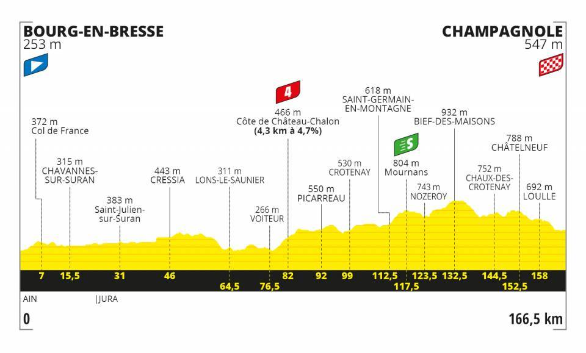

# README

General ranking data of the Tour de France 2020. Scrapped from https://letour.fr.

## Data

- [general_classification.json](./general_classification.json): the general ranking, after each stage of the Tour de France 2020.

  ```json
  [
    [
      {
        "rank": 1,
        "name": "MIKE TEUNISSEN",
        "number": 87,
        "team": "TEAM JUMBO - VISMA",
        "time": 15767,
        "gap": 0,
        "bonif": 10,
        "penal": 0,
        "raw": "1|MIKE TEUNISSEN|87|TEAM JUMBO - VISMA|04h 22' 47''|-|B : 10''|-"
      },
      {
        "rank": 2,
        "name": "PETER SAGAN",
        "number": 11,
        "team": "BORA - HANSGROHE",
        "time": 15767,
        "gap": 0,
        "bonif": 6,
        "penal": 0,
        "raw": "2|PETER SAGAN|11|BORA - HANSGROHE|04h 22' 47''|-|B : 6''|-"
      }
      ...
    ]
  ]
  ```

- [teams.json](./teams.json): the 22 teams

  ```json
  [
    { "name": "TEAM INEOS", "colour": "#910024" },
    { "name": "BORA - HANSGROHE", "colour": "#76BFCB" }
    ...
  ]
  ```

- [profile_images](./profile_images/): elevation profile image of every stage

  

- [riders_images](./riders_images/): picture of the 6 main riders

  

## Rebuild the data

Generate the general rankings JSON ([general_classification.json](./general_classification.json))

```
python3 build_general_classification.py
```

Note that `build_general_classification.py` doesn't download the HTML pages, but requires them to be available locally (they have been saved on 2020/xx/xx in the [saved_html/](./saved_html/) directory).

The [profile_images/\*.jpeg](./profile_images/) and [riders_images/\*.jpeg](./riders_images/) files have also been downloaded manually.
